# Afridrop - Technical Documentation

## 1. Executive Summary

Afridrop is a modern, high-performance web application designed for pool construction services and e-commerce. Built on **Next.js 16 (App Router)**, it leverages server-side rendering (SSR) and React Server Components (RSC) for optimal SEO and performance. The system manages content (blog, projects), e-commerce operations (products, orders, payments), and customer interactions (quotations, contact).

### Key Technologies

- **Frontend Framework**: Next.js 16 (React 19)
- **Styling**: Tailwind CSS v4, Lucide React
- **Database**: PostgreSQL
- **ORM**: Drizzle ORM
- **Authentication**: NextAuth.js (v5 Beta)
- **API Layer**: Server Actions & tRPC (v11)
- **Validation**: Zod
- **Payments**: Flutterwave Integration

---

## 2. System Architecture

### 2.1 High-Level Architecture

The application follows a **Monolithic Architecture** optimized for the Vercel edge/serverless ecosystem.

- **Client Layer**: Responsive UI built with React Server Components and Client Components for interactivity (e.g., Pool Configurator).
- **Application Layer**: Next.js App Router handling routing, API endpoints (via Server Actions/tRPC), and business logic.
- **Data Access Layer**: Drizzle ORM provides type-safe SQL query construction and migration management.
- **Database Layer**: PostgreSQL database storing relational data for users, products, orders, and content.

### 2.2 Directory Structure

- `src/app`: Page routes and layouts (App Router).
- `src/components`: Reusable UI components (Common, Home, Services, etc.).
- `src/db`: Database configuration, Drizzle schema definitions, and seed scripts.
- `src/lib`: Utility functions, auth configuration, and shared logic.
- `src/server`: Backend logic, tRPC routers, and procedures.

---

## 3. Database Design

The database is normalized and relational, designed to support scalability and data integrity.

### 3.1 Entity Relationship Diagram (ERD)

```mermaid
erDiagram
    %% AUTH MODULE
    USERS ||--o{ ACCOUNTS : "has"
    USERS ||--o{ SESSIONS : "has"
    USERS ||--o{ ROLES_USERS : "assigned"
    ROLES ||--o{ ROLES_USERS : "granted"
    ROLES ||--o{ PERMISSIONS_ROLES : "includes"
    PERMISSIONS ||--o{ PERMISSIONS_ROLES : "belongs"

    %% BLOG MODULE
    USERS ||--o{ BLOG_POSTS : "authors"
    BLOG_POSTS ||--o{ BLOG_COMMENTS : "has"
    BLOG_POSTS ||--o{ BLOG_POSTS_CATEGORIES : "categorized"
    BLOG_CATEGORIES ||--o{ BLOG_POSTS_CATEGORIES : "contains"
    BLOG_POSTS ||--o{ BLOG_POSTS_TAGS : "tagged"
    BLOG_TAGS ||--o{ BLOG_POSTS_TAGS : "labels"

    %% PRODUCT & E-COMMERCE MODULE
    PRODUCTS ||--o{ PRODUCT_VARIANTS : "has"
    PRODUCTS ||--o{ PRODUCT_IMAGES : "visualized"
    PRODUCTS ||--o{ PRODUCTS_CATEGORIES : "categorized"
    PRODUCT_CATEGORIES ||--o{ PRODUCTS_CATEGORIES : "contains"

    %% ORDER MODULE
    USERS ||--o{ ORDERS : "places"
    ORDERS ||--o{ ORDER_ITEMS : "contains"
    PRODUCTS ||--o{ ORDER_ITEMS : "referenced"
    PRODUCT_VARIANTS ||--o{ ORDER_ITEMS : "variant"

    %% CART
    USERS ||--o{ CART_ITEMS : "owns"
    PRODUCTS ||--o{ CART_ITEMS : "contains"

    %% PAYMENTS & INVENTORY
    ORDERS ||--o{ PAYMENTS : "paid via"
    USERS ||--o{ PAYMENTS : "made by"
    PRODUCTS ||--o{ INVENTORY_STOCK : "stocked"
    PRODUCTS ||--o{ INVENTORY_TRANSACTIONS : "adjusted"

    %% PROJECTS & QUOTATIONS
    USERS ||--o{ PROJECTS : "created"
    PROJECTS ||--o{ PROJECT_IMAGES : "shows"
    USERS ||--o{ QUOTATIONS : "requested by"
    QUOTATIONS ||--o{ QUOTATION_ITEMS : "includes"

    USERS {
        uuid id PK
        string email
        string password_hash
        string first_name
        string last_name
        string role
    }

    BLOG_POSTS {
        uuid id PK
        string title
        string slug
        string status
        uuid author_id FK
    }

    PRODUCTS {
        uuid id PK
        string sku
        string name
        decimal price
        boolean is_active
    }

    ORDERS {
        uuid id PK
        string order_number
        decimal total
        string status
        uuid user_id FK
    }

    PAYMENTS {
        uuid id PK
        decimal amount
        string status
        string method
        uuid order_id FK
    }
```

---

## 4. Security Implementation

### 4.1 Authentication & Authorization

- **NextAuth.js**: Handles session management, OAuth providers, and credential-based login.
- **RBAC (Role-Based Access Control)**: Implemented via `roles`, `permissions`, `roles_users`, and `permissions_roles` tables. Critical actions check for specific permissions before execution.
- **Session Management**: Secure, HTTP-only cookies store session tokens, with server-side validation against the `sessions` table.

### 4.2 Data Protection

- **Type Safety**: TypeScript integration throughout the stack prevents type-related vulnerabilities.
- **SQL Injection Prevention**: Drizzle ORM uses parameterized queries by default, neutralizing SQL injection vectors.
- **Input Validation**: Zod schemas validate all incoming data (API requests, form submissions) before processing, adhering to the "Fail Fast" principle.

### 4.3 Application Security

- **CSRF Protection**: Next.js built-in protection for Server Actions and API routes.
- **Audit Logging**: The `audit_logs` table tracks critical system actions (login, data modification), recording `user_id`, `action`, `resource`, `ip_address`, and `changes`.

---

## 5. Software Development Life Cycle (SDLC)

We utilize an **Agile/Iterative Model** to ensure flexibility and rapid delivery.

1.  **Planning**: Define requirements (e.g., "Need dynamic pool configurator"). Create user stories and task lists (`task.md`).
2.  **Analysis**: Analyze technical feasibility. Select tools (e.g., specific React libraries).
3.  **Design**:
    - **UI/UX**: Create mockups or implementation plans.
    - **DB**: Schema modeling in `src/db/schema`.
4.  **Implementation**: Writing clean, modular code. adhering to Clean Architecture principles.
5.  **Testing**:
    - **Manual Testing**: Verifying flows (Client Portal, Checkout).
    - **Linting**: Static analysis via ESLint to catch errors early.
6.  **Deployment**: Push to Git -> CI/CD -> Vercel Deployment.
7.  **Maintenance**: Monitoring logs, addressing user feedback, and iterative updates.

---

## 6. Security SDLC (SecSDLC)

Security is integrated into every phase of the SDLC, not treated as an afterthought.

1.  **Security Requirements**: Define security constraints during planning (e.g., "Payment data must not be stored plainly").
2.  **Threat Modeling**: During design, identify potential attack vectors (e.g., "Can a user access another user's quote?").
    - - mitigation\*: enforce RLS-like logic in data access layers.
3.  **Secure Coding**:
    - Adherence to OWASP Top 10 guidelines.
    - Use of strict Zod validation schemas.
    - Avoidance of `dangerouslySetInnerHTML`.
4.  **Security Testing**:
    - **SAST**: Static analysis tools running in CI.
    - **DAST**: Runtime testing of endpoints.
    - **Peer Review**: Mandatory code reviews focusing on logic flaws and auth checks.
5.  **Secure Deployment**:
    - Environment variables (`.env.local`) management.
    - HTTPS enforcement.
    - Database connection security (SSL).
6.  **Incident Response**:
    - Audit logs (`audit_logs` table) provide forensic data.
    - Procedures for rotating secrets if creating a breach.

---

_Documentation generated by **Antigravity** on behalf of the Engineering Team._
